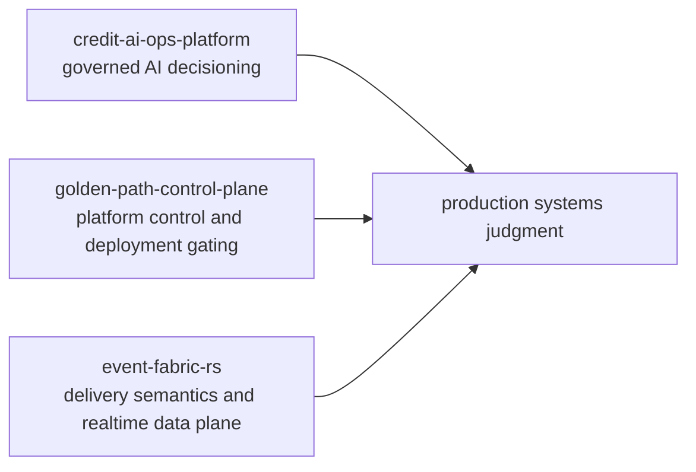

# Systems For The Parts Of Production That Do Not Forgive Wishful Thinking

Backend and platform engineer working across Go, Rust, Python, and TypeScript.

My work centers on systems that have to remain explainable under stress: asynchronous processing, delivery guarantees, control planes, model governance, audit reconstruction, and the operational edges where architecture review stops being theoretical.

## Flagship Systems

| System | Thesis | Stack |
| --- | --- | --- |
| [credit-ai-ops-platform](https://github.com/JuanPabloGaviria/credit-ai-ops-platform) | Credit decisioning should be treated as a governed operational system, not a model-serving demo. | Python, FastAPI, RabbitMQ, PostgreSQL, MLOps |
| [golden-path-control-plane](https://github.com/JuanPabloGaviria/golden-path-control-plane) | Release readiness is a control-plane problem with durable evidence, not a spreadsheet ritual. | Go, PostgreSQL, OIDC/JWKS, Docker, Kubernetes |
| [event-fabric-rs](https://github.com/JuanPabloGaviria/event-fabric-rs) | Event delivery becomes credible when ingest, retries, replay, dead letters, and realtime fanout are all made explicit. | Rust, axum, tokio, PostgreSQL, SSE, webhooks |

## What These Repositories Show

- distributed systems built around failure handling, not just happy-path throughput
- explicit contracts, persistence semantics, and verifiable runtime boundaries
- platform and infrastructure judgment without microservice theater
- documentation written to survive review against the running system
- proof surfaces that can be rerun locally instead of being defended with screenshots

## Systems Map

## Current Focus

- distributed systems
- platform engineering
- AI infrastructure and MLOps
- observability and operational resilience
- payment, identity, and event-driven backend design

## Working Style

- fail fast on invalid assumptions
- keep contracts explicit
- treat auditability and observability as runtime features
- prefer narrow, defensible claims over inflated breadth
- optimize for systems that can survive technical scrutiny

## Contact

- [LinkedIn](https://linkedin.com/in/jpgaviria)

Remote preferred. Open to relocation for exceptional opportunities.

---

*Tempus Edax Rerum*
